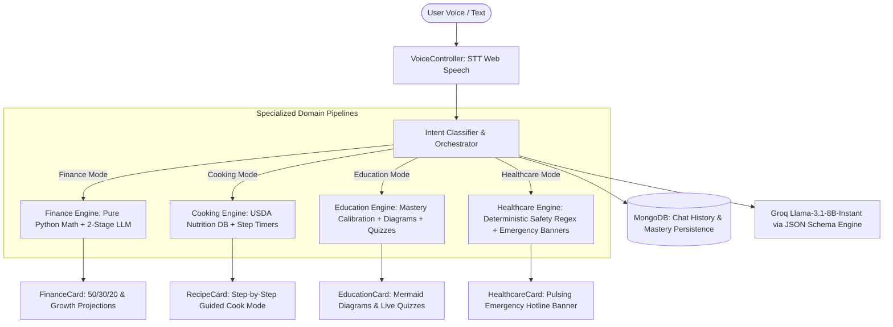

# NexusAI — Autonomous Multi-Domain Voice Assistant

NexusAI is a full-stack, voice-first intelligent assistant platform featuring specialized domain execution pipelines (**Finance, Cooking, Education, Healthcare**), structured Pydantic response modeling, MongoDB context and user profile persistence, JWT authentication, and interactive domain UI cards with real-time timers and visualization diagrams.

---

## 🏛️ System Architecture

NexusAI differentiates assistant domains **architecturally**, not merely through prompt wording:



### 1. Finance Assistant Pipeline
- **Deterministic Python Engine (`finance_engine.py`)**: Computes exact savings rates, 50/30/20 budget distributions, emergency fund runways, future value compound interest growth, and amortization payoff timelines.
- **2-Stage Synthesis**: Extraction pass $\rightarrow$ Python arithmetic calculation $\rightarrow$ Qualitative financial recommendation synthesis.
- **Frontend Card (`FinanceCard.tsx`)**: Visual metrics grid, progress bars, 50/30/20 budget ratio bar, and risk callouts in clean, slate-dark tones.

### 2. Cooking Assistant Pipeline
- **USDA-Calibrated Nutrition Engine (`cooking_engine.py` & `nutrition_db.py`)**: Computes exact macronutrients (calories, protein, carbs, fat, fiber) across 100+ vetted ingredients and attaches tested substitutions.
- **Guided Step-by-Step Mode (`RecipeCard.tsx`)**: Presents recipes one step at a time (`Step 1 of N`) with countdown step timers, `[Next Step]` controls, ingredient checklists with checkboxes, and `[🔊 Read Aloud]` voice support.

### 3. Education Assistant Pipeline
- **Mastery Tracker (`mastery_service.py`)**: Tracks quiz attempts in MongoDB to dynamically adjust pedagogical depth (`beginner`, `intermediate`, `advanced`).
- **Visual Concepts & Quizzes (`EducationCard.tsx`)**: Renders Mermaid flowcharts/timelines (`MermaidDiagram.tsx`) and client-side graded quizzes with instant feedback (`QuizCard.tsx`).

### 4. Healthcare Assistant Pipeline
- **Deterministic Red-Flag Regex Engine (`safety_rules.py`)**: Pre- and post-LLM gating for cardiac, stroke (FAST), anaphylaxis, respiratory distress, and pediatric fevers.
- **Emergency Protection (`HealthcareCard.tsx`)**: Unoverridable emergency warning banners and local hotline numbers.

---

## 🛠️ Technology Stack

| Layer | Technology |
|---|---|
| **Frontend** | React 18, TypeScript, Vite, Tailwind CSS, Lucide Icons, Mermaid.js |
| **Styling & Theme** | Minimalist Obsidian Dark Glassmorphism, Electric Cyan (`#00f0ff`), Slate Surfaces |
| **Backend** | FastAPI, Python 3.12+, Uvicorn |
| **LLM Inference** | Groq API (`llama-3.1-8b-instant` / `openai/gpt-oss-20b`) |
| **Database** | MongoDB (`users`, `chats`, `education_mastery` collections) |
| **Auth & Security** | JWT (HS256) + `bcrypt` Password Hashing |
| **Speech Loop** | Browser Web Speech API (STT) + Edge TTS / Browser SpeechSynthesis (TTS) |

---

## 🚀 Getting Started

### Prerequisites
- **Node.js 18+** & **npm**
- **Python 3.10+**
- **MongoDB** (running locally on port `27017` or via MongoDB Atlas)
- **Groq API Key** ([console.groq.com](https://console.groq.com))

---

### Step 1: Backend Setup

1. Navigate to the backend directory:
   ```bash
   cd multi_domain_voice_assistant
   ```

2. Install dependencies:
   ```bash
   pip install -r requirements.txt
   ```

3. Create/verify `.env` configuration:
   ```env
   GROQ_API_KEY=your_groq_api_key_here
   GROQ_MODEL=llama-3.1-8b-instant

   MONGODB_URI=mongodb://localhost:27017
   MONGODB_DB_NAME=nexusai

   JWT_SECRET=your_super_secret_jwt_key
   JWT_EXPIRES_SECONDS=604800
   ```

4. Start the FastAPI server:
   ```bash
   python run.py
   ```
   *The backend will be available at `http://localhost:8000`. Health check: `http://localhost:8000/health`.*

---

### Step 2: Frontend Setup

1. From the project root:
   ```bash
   npm install
   ```

2. Start the Vite development server:
   ```bash
   npm run dev
   ```
   *The frontend will run at `http://localhost:8080` (or `http://localhost:5173`).*

---

## 🧪 Testing & Verification

Run the full backend test suite:
```bash
cd multi_domain_voice_assistant
pytest tests/
```

Run frontend build verification:
```bash
npm run build
```

---

## 🔒 Authentication & Demographics

Registration collects:
- **Full Name** & **Email**
- **Age**: Categorized dynamically into demographic cohorts (*Child, Young Student, Adult Professional, Senior*).
- **Education Level Dropdown**: *Middle School, High School, Undergraduate, Graduate, Doctorate, Trade / Vocational, Self-Taught*.
- **Primary Goal**: Personalizes prompt styling and mastery level.

---

## 📁 Project Structure

```
├── src/
│   ├── components/
│   │   ├── domain/               # Specialized domain cards
│   │   │   ├── FinanceCard.tsx   # Math engine visualization & 50/30/20 ratio
│   │   │   ├── RecipeCard.tsx    # Guided step-by-step cooking & USDA macros
│   │   │   ├── EducationCard.tsx # Explanation, Mermaid diagrams & quizzes
│   │   │   ├── HealthcareCard.tsx# Emergency banner & clinical guidance
│   │   │   ├── MermaidDiagram.tsx# Dynamic visual diagram renderer
│   │   │   └── QuizCard.tsx      # Self-grading interactive quiz
│   │   ├── AssistantTypewriter.tsx# Types conversational prose without raw JSON
│   │   ├── VoiceController.tsx   # Continuous STT -> Chat -> TTS voice loop
│   │   ├── MessageBubble.tsx     # Clean message bubble renderer
│   │   ├── MessageContent.tsx    # Polymorphic card & markdown renderer
│   │   ├── Navbar.tsx            # Auth status & navigation
│   │   └── DomainSidebar.tsx     # Real-time domain pipeline switcher
│   ├── context/
│   │   ├── AuthContext.tsx       # JWT token management & user session
│   │   └── ChatContext.tsx       # Message persistence & voice loop state
│   ├── lib/
│   │   ├── structuredOutputParser.ts # Safely parses JSON into human intros
│   │   └── stripMarkdownForTts.ts   # Cleans text for speech synthesis
│   └── pages/                    # Auth, Chat, Home, Profile, About
│
└── multi_domain_voice_assistant/
    ├── app/
    │   ├── assistants/           # 4 Specialized domain assistants
    │   │   ├── finance/          # Pure Python arithmetic engine
    │   │   ├── cooking/          # USDA nutrition database & substitutions
    │   │   ├── education/        # Mastery service & difficulty calibration
    │   │   └── healthcare/       # Red-flag regex safety rules
    │   ├── auth/                 # JWT security, models & routes
    │   ├── db/                   # MongoDB connection client
    │   ├── groq/                 # Groq API client
    │   ├── llm/                  # Pydantic schemas & JSON structured engine
    │   ├── tts/                  # Edge TTS voice audio streaming
    │   ├── context_manager.py    # MongoDB persistent chat sliding window
    │   ├── intent_router.py      # Keyword + LLM hybrid classifier
    │   ├── orchestrator.py       # Central multi-domain orchestrator
    │   └── main.py               # FastAPI application endpoints
    ├── evals/                    # 20+ query evaluation harness
    └── tests/                    # Pytest unit & integration test suite
```
