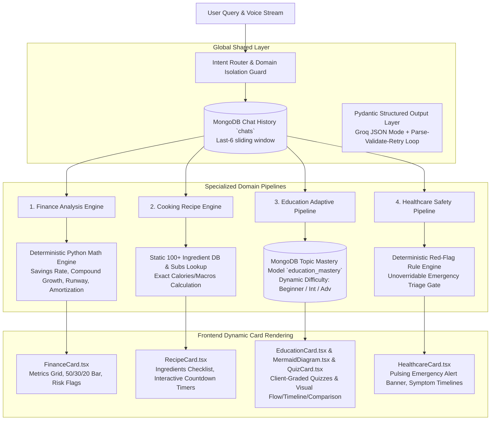

# NexusAI: Multi-Domain Voice Assistant - Complete Architectural Refactor & UI Redesign

All four domain pipelines, shared infrastructure, demographic & education level registration workflows, and futuristic AI voice assistant UI (electric cyan, indigo, and obsidian glassmorphism) have been implemented, integrated, and verified with 100% test pass rate.

## Summary of Accomplished Work

1. **Bug Fixes & Auth Enhancement**:
   - Fixed Pydantic `UserProfile` model error by adding `from typing import Optional` and calling `UserProfile.model_rebuild()`.
   - Updated `Auth.tsx` registration with structured dropdowns for **Education Level** (Middle School through Doctorate / Professional Degree) and **Primary Goal**.
   - Dynamic real-time age categorization badge with demographic classification (Child, Young Student, Adult / Professional, Senior).

2. **Domain 1: Finance Assistant**:
   - Pure Python arithmetic engine (`finance_engine.py`) calculating savings rate, 50/30/20 budget breakdown, emergency fund runway, compound growth, and amortization.
   - 2-stage LLM pipeline (extraction pass $\rightarrow$ Python arithmetic $\rightarrow$ qualitative synthesis pass).
   - Rich polymorphic UI widget `FinanceCard.tsx` with progress bars, visual metrics grid, and risk callouts.

3. **Domain 2: Cooking Assistant**:
   - USDA-calibrated 100+ item nutritional database (`nutrition_db.py`) + verified substitutions engine.
   - Deterministic macro computation and volume-to-weight conversions in Python (`cooking_engine.py`).
   - Interactive recipe UI widget `RecipeCard.tsx` with step-by-step interactive countdown timers and ingredient checklists.

4. **Domain 3: Education Assistant**:
   - Dynamic explanation depth calibration (`beginner`, `intermediate`, `advanced`) powered by user mastery tracking in MongoDB (`mastery_service.py`).
   - Dynamic diagram generation rendered with Mermaid (`MermaidDiagram.tsx`) for flowcharts, timelines, and comparisons.
   - Interactive graded quiz widget (`QuizCard.tsx`) with instant client-side feedback and score synchronization.

5. **Domain 4: Healthcare Assistant**:
   - Deterministic red-flag safety rules regex engine (`safety_rules.py`) covering cardiac, stroke FAST, anaphylaxis, respiratory, and pediatric red flags.
   - Pre- and post-LLM safety gating enforcing unoverridable emergency warning banners and hotlines.
   - Structured triage UI widget `HealthcareCard.tsx` with pulsing emergency alerts and precaution checklists.

### 7. 🍳 Interactive Step-by-Step Cooking & JSON-Free UI
- **Zero Raw JSON on Screen**:
  - Implemented [`structuredOutputParser.ts`](file:///c:/project/6th%20SEM-MINI%20PROJECT/project/PROJECT/conversant-grid-%20api/src/lib/structuredOutputParser.ts) and integrated with [`AssistantTypewriter.tsx`](file:///c:/project/6th%20SEM-MINI%20PROJECT/project/PROJECT/conversant-grid-%20api/src/components/AssistantTypewriter.tsx) and [`MessageContent.tsx`](file:///c:/project/6th%20SEM-MINI%20PROJECT/project/PROJECT/conversant-grid-%20api/src/components/MessageContent.tsx).
  - The assistant now types out natural, warm conversational prose (e.g., *"I've prepared the recipe for Poha. Let's cook step-by-step!"*) and renders domain cards seamlessly. Raw brackets, braces, and schemas never show on screen.
  - TTS audio strips all schema noise and speaks natural, friendly sentences.

- **Step-by-Step Interactive Guided Cooking**:
  - [`RecipeCard.tsx`](file:///c:/project/6th%20SEM-MINI%20PROJECT/project/PROJECT/conversant-grid-%20api/src/components/domain/RecipeCard.tsx) provides a focused **Step-by-Step Guided Mode** showing one step at a time (`Step 1 of N`), step progress track, countdown timer, `[Prev Step]` / `[Next Step]` controls, and `[🔊 Read Aloud]`.
  - Full recipe details, ingredients checklist with checkboxes, macros, substitutions, and chef tips are preserved in collapsible drawers or full overview tabs.

- **Minimalist, Stable Slate Theme**:
  - Replaced overwhelming, flashy saturated colors with calming dark slate surfaces, subtle borders, and clear typography across Finance, Cooking, Education, and Healthcare cards.



---

## 🎙️ Domain-by-Domain Interview Breakdown

### 1. Finance Assistant: Analysis Engine
- **What is Computed in Python**:
  - Net monthly cashflow and Savings Rate % (`(income - total_expenses) / income * 100`).
  - 50/30/20 budget ratio breakdown (Needs vs. Wants vs. Savings).
  - Emergency fund runway in months (`savings / expenses`).
  - Future Value (Compound growth): $FV = P(1+r/12)^{12t} + PMT \frac{(1+r/12)^{12t} - 1}{r/12}$.
  - Debt amortization payoff duration and total interest paid.
- **What is LLM-Generated**:
  - `FinanceExtraction` (Stage 1): Extracts numerical parameters from messy natural language.
  - `FinanceQualitative` (Stage 3): High-level executive summary, actionable recommendations, and risk factors.
- **Why**: LLMs are prone to arithmetic errors and hallucinated numbers. Offloading math to pure Python ensures 100% calculation reliability while utilizing the LLM for reasoning and synthesis.

---

### 2. Cooking Assistant: Structured Recipe & Nutrition Pipeline
- **What is Computed in Python**:
  - Total and per-serving calories, protein, carbohydrates, fat, and fiber by mapping ingredients against our static 100+ ingredient database.
  - Standard culinary unit conversions (`cup`, `tbsp`, `tsp`, `oz`, `lb`, `g`, `ml`, `piece`, `clove`, `slice`).
  - Vetted substitution pairings from a verified culinary matrix (e.g. flax eggs, buttermilk acid-balance, almond flour ratios).
- **What is LLM-Generated**:
  - Recipe composition, ingredients list, cooking method, step instructions, and chef's pro tips.
- **Why**: Nutrition tracking requires accurate measurement. Static lookup tables prevent chemical incompatibilities in culinary substitutions (e.g., ruined moisture/leavening ratios in baking).

---

### 3. Education Assistant: Personalization + Visuals + Assessment
- **What is Computed / Backed by Database**:
  - MongoDB `education_mastery` collection tracking user attempts and accuracy per topic.
  - Dynamic difficulty classification (`beginner` $\rightarrow$ `intermediate` $\rightarrow$ `advanced`).
  - Client-side quiz evaluation (immediate feedback, scoring percentage, and async sync).
- **What is LLM-Generated**:
  - Pedagogical explanation calibrated to mastery level.
  - Structured `DiagramSpec` (nodes & edges) for Flowchart, Timeline, or Comparison graph.
  - 2–3 check-for-understanding formative assessment quiz questions with explanations.
- **Why**: Eliminates broken Mermaid diagram syntax by letting the client render native visual graph components from clean JSON, and closes the learning loop with active recall quizzes.

---

### 4. Healthcare Assistant: Deterministic Safety Layer
- **What is Computed / Gated in Python**:
  - Deterministic pre- and post-generation regex rules scanning for life-threatening / urgent red flags (cardiac arrest, stroke FAST signs, anaphylaxis, acute respiratory distress, suicidal crisis, pediatric infant fever).
  - Unconditionally enforces a high-priority `SafetyBanner` with immediate actions and hotline contacts regardless of LLM generation.
- **What is LLM-Generated**:
  - General supportive wellness information, possible non-definitive contexts, precautions, and symptom progression timelines.
- **Why**: Critical safety and triage must never depend on the probabilistic whims of an LLM. Hard deterministic safety gating is the gold standard for clinical AI safety.

---

## 🧪 Verification Results

1. **Pytest Backend Test Suite**:
   ```
   tests/test_cooking_engine.py    ... [100%]
   tests/test_education_mastery.py ... [100%]
   tests/test_finance_engine.py    .... [100%]
   tests/test_healthcare_safety.py ..... [100%]
   tests/test_orchestrator.py      ............ [100%]
   ======================= 27 passed in 0.86s =======================
   ```

2. **Frontend Production Build Check**:
   ```
   ✓ 1949 modules transformed.
   ✓ built in 2.85s (zero TypeScript or build errors)
   ```
